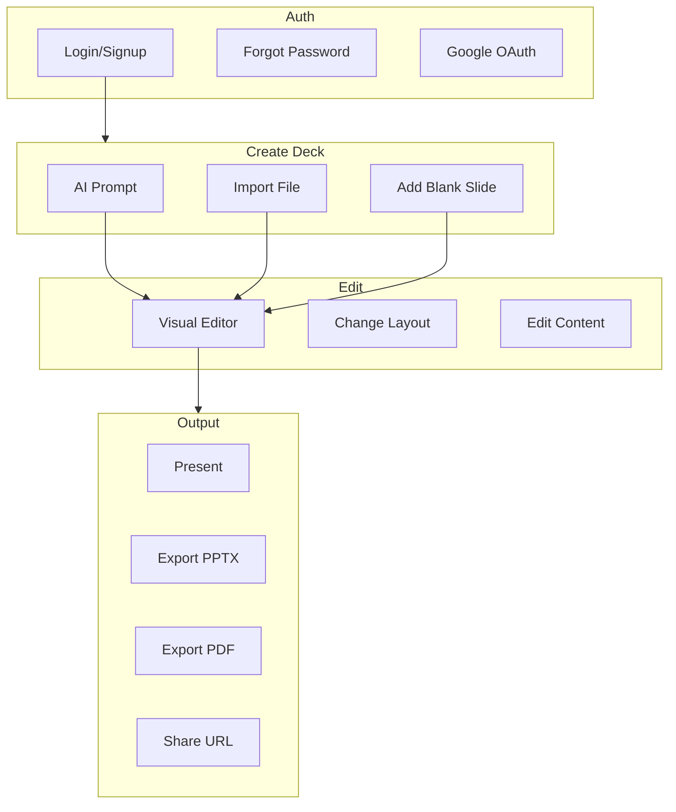

# SlideMaker / DeckShare — Platform Overview

A concise reference for agents and collaborators to understand the system and iterate on ideas.

---

## 1. Executive Summary

**DeckShare** (also SlideMaker) is an AI-powered slide deck creator. Users generate decks from a text prompt or by importing PDF, Word, or PowerPoint files; edit slides in a visual 3-panel editor; and export to PPTX or PDF or present full-screen. Value prop: create professional presentations quickly with AI and manual control.

---

## 2. Tech Stack

| Layer | Technology |
|-------|------------|
| Frontend | Next.js 16, React 19, TypeScript, TailwindCSS |
| Auth | Supabase (email/password, Google OAuth) |
| Storage | Supabase PostgreSQL when logged in; localStorage when anonymous |
| AI | Groq (Llama 3.3 70B) |
| Images | Pollinations.ai (no API key) |
| Export | PPTX (pptxgenjs), PDF (html2canvas + jsPDF) |
| Import | pdf-parse, mammoth, pptx-content-extractor |

---

## 3. Core User Flows



---

## 4. Data Model

### Deck

| Field | Type | Description |
|-------|------|-------------|
| `id` | string | `deck_<timestamp>_<random>` |
| `title` | string | Deck title |
| `slides` | EditableSlide[] | Slide array |
| `updatedAt` | string | ISO timestamp |
| `deletedAt` | string? | Soft delete |
| `isDraft` | boolean? | Draft flag |

### Slide (EditableSlide)

| Field | Type | Description |
|-------|------|-------------|
| `title` | string | Slide title |
| `subtitle` | string \| null | Optional subtitle |
| `bullets` | string[] | Bullet points |
| `layout` | LayoutKey | One of 24+ layouts |
| `theme` | string | "default" |
| `imagePrompt` | string? | Pollinations prompt (image-text, case-study) |
| `backgroundPrompt` | string? | Full-slide background |
| `elements` | SlideElement[]? | Freeform layout only |

### SlideElement (freeform)

| Field | Type |
|-------|------|
| `id` | string |
| `type` | "text" \| "image" |
| `x`, `y`, `w`, `h` | number |
| `content` | string |
| `fontSize` | number? |

---

## 5. Key Routes and Entry Points

| Route | Purpose |
|-------|---------|
| `/login`, `/signup` | Auth |
| `/forgot-password`, `/reset-password` | Password reset |
| `/dashboard` | Deck list |
| `/editor` | New deck |
| `/editor?deck=<id>` | Edit existing deck |
| `/editor?template=<id>` | Start from built-in template |
| `/editor?htmlTemplate=<id>` | Start from Stitch HTML template |
| `/editor/present?deck=<id>` | Full-screen presentation |
| `/trash` | Trashed decks |
| `/shared` | Shared decks |
| `/settings` | User settings |
| `/templates` | Template gallery |

### API Routes

| Route | Method | Purpose |
|-------|--------|---------|
| `/api/generate` | POST | AI slide generation |
| `/api/import` | POST | Import PDF, TXT, DOCX, PPTX |
| `/api/export/pptx` | POST | Export to PPTX |
| `/api/usage` | GET | AI usage (remaining/limit) |
| `/api/health` | GET | Health check |
| `/auth/callback` | GET | OAuth code exchange |

---

## 6. Layout System

- **24+ layouts**: hero, title-card, bullet-list, agenda, two-column, process-flow, image-text, product-features, title-only, quote, stats, team-overview, testimonials, case-study, company-values, pricing, data-chart, timeline, milestones, swot, global-presence, next-steps, partner-logos, thank-you, freeform
- **AI selection**: Groq chooses layout per slide using `LAYOUT_PROMPT_DESCRIPTIONS` in `lib/design-system.ts`
- **Freeform**: Draggable text/image elements, snap-to-grid (24px), `GRID_CELL` constant

---

## 7. Design System

- **DESIGN.md** — Forge Logic Light: primary `#FF0000`, secondary `#000000`, tertiary `#424242`, high contrast, dotted grid
- **lib/design-system.ts** — `DS` colors, `LAYOUTS`, `LAYOUT_MAP`, `GRID_CELL`, `LAYOUT_PROMPT_DESCRIPTIONS`
- **tailwind.config.ts** — `primary`, `secondary`, `tertiary` colors

---

## 8. Known Gaps / Areas for Iteration

- Freeform `elements` not exported to PPTX/PDF
- Some layouts (agenda, two-column, process-flow, etc.) lack inline WYSIWYG editing; use right panel only
- Daily AI limit (5 generations) per user
- No real-time collaboration
- Legacy `.ppt` not supported for import (only `.pptx`)
- Supabase must be configured for auth and deck persistence; anonymous users use localStorage only

---

## 9. Environment Variables

### Frontend (`frontend-next/.env.local`)

| Variable | Required | Purpose |
|----------|----------|---------|
| `GROQ_API_KEY` | Yes | Groq API key for AI generation |
| `NEXT_PUBLIC_SUPABASE_URL` | Yes | Supabase project URL |
| `NEXT_PUBLIC_SUPABASE_ANON_KEY` | Yes | Supabase anon key |
| `NEXT_PUBLIC_API_URL` | No | Optional Python backend URL |

### Backend (`backend/.env`)

| Variable | Purpose |
|----------|---------|
| `GROQ_API_KEY` | Groq API key |
| `SUPABASE_URL` | Supabase project URL |
| `SUPABASE_ANON_KEY` | Supabase anon key |
| `SUPABASE_SERVICE_ROLE_KEY` | Supabase service role key |

---

## 10. Project Structure

```
slidemaker/
├── frontend-next/          # Next.js app
│   ├── app/
│   │   ├── (auth)/         # login, signup, forgot-password, reset-password
│   │   ├── (app)/          # dashboard, editor, present, trash, shared, team, settings, templates
│   │   └── api/            # generate, import, export, usage, templates, health
│   ├── components/slides/ # SlideRenderer, layout components (HeroSlide, FreeformSlide, etc.)
│   ├── lib/                # api, deck-storage, design-system, templates, pollinations, supabase
│   └── supabase/migrations/
├── backend/                # Optional FastAPI (generate, export)
├── DESIGN.md               # Design system spec
└── PLATFORM.md             # This document
```
