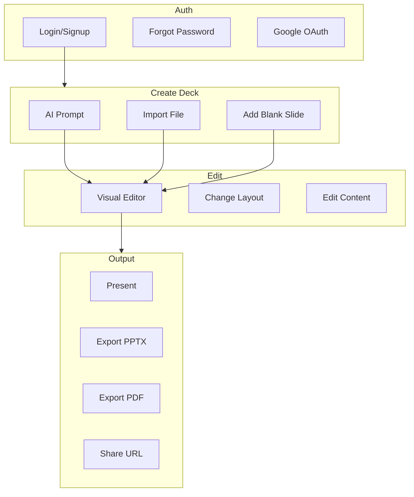
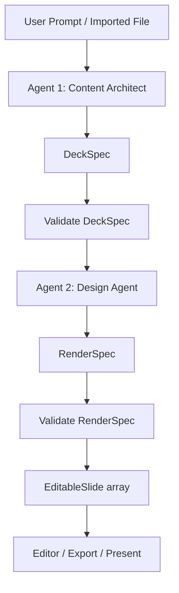

# SlideMaker / DeckShare — Platform Overview

A concise reference for agents and collaborators to understand the system and iterate on ideas.

---

## 1. Executive Summary

**DeckShare** (also SlideMaker) is an AI-powered slide deck creator. Users generate decks from a text prompt or by importing PDF, Word, or PowerPoint files; edit slides in a visual 3-panel editor; and export to PPTX or PDF or present full-screen. Value prop: create professional presentations quickly with AI and manual control.

---

## 2. Tech Stack

| Layer | Technology |
|-------|------------|
| Frontend | Next.js 16, React 19, TypeScript, TailwindCSS |
| Auth | Supabase (email/password, Google OAuth) |
| Storage | Supabase PostgreSQL when logged in; localStorage when anonymous |
| AI | Groq (Llama 3.3 70B) for generation; optional Gemini for Content Architect agent |
| AI orchestration | Two-agent pipeline (Content Architect + Design Agent) |
| Images | Pollinations.ai (no API key) |
| Export | PPTX (pptxgenjs), PDF (html2canvas + jsPDF) |
| Import | pdf-parse, mammoth, pptx-content-extractor |

---

## 3. Core User Flows



---

## 4. AI Generation Architecture

The platform uses a two-agent pipeline: Content Architect (Agent 1) produces semantic structure; Design Agent (Agent 2) maps to layouts and produces renderable slides. Orchestration runs inside `POST /api/generate`; externally it remains a single endpoint.



- **Agent 1 (Content Architect)**: prompt/file → structured deck spec (purpose, content, narrative). Does not choose layouts.
- **Agent 2 (Design Agent)**: DeckSpec + template registry → layout choice + slot mapping → EditableSlide[]. Does not rewrite content.
- **Orchestration**: Single `POST /api/generate`; internally runs content → validate → design → validate → return.
- **Model assignment**: Groq for both agents (current); optional Gemini for Agent 1 (stronger reasoning, long context).
- **Critical rule**: Agent 1 produces semantic structure; Agent 2 produces presentation mapping; no shared mutation.

---

## 5. Data Model

### Deck

| Field | Type | Description |
|-------|------|-------------|
| `id` | string | `deck_<timestamp>_<random>` |
| `title` | string | Deck title |
| `slides` | EditableSlide[] | Slide array |
| `updatedAt` | string | ISO timestamp |
| `deletedAt` | string? | Soft delete |
| `isDraft` | boolean? | Draft flag |

### Slide (EditableSlide)

| Field | Type | Description |
|-------|------|-------------|
| `title` | string | Slide title |
| `subtitle` | string \| null | Optional subtitle |
| `bullets` | string[] | Bullet points |
| `layout` | LayoutKey | One of 24+ layouts |
| `theme` | string | "default" |
| `imagePrompt` | string? | Pollinations prompt (image-text, case-study) |
| `backgroundPrompt` | string? | Full-slide background |
| `elements` | SlideElement[]? | Freeform layout only |

### SlideElement (freeform)

| Field | Type |
|-------|------|
| `id` | string |
| `type` | "text" \| "image" |
| `x`, `y`, `w`, `h` | number |
| `content` | string |
| `fontSize` | number? |

### AI Generation Data Contracts

Internal types used between agents (not persisted).

**DeckSpec (Agent 1 output)**

| Field | Type | Description |
|-------|------|-------------|
| `deckTitle` | string | Deck title |
| `audience` | string? | Target audience |
| `tone` | string? | formal / bold / storytelling |
| `slides` | SlideSpec[] | Per-slide content |

**SlideSpec**

| Field | Type | Description |
|-------|------|-------------|
| `purpose` | string | hero, problem, solution, etc. |
| `title` | string | Slide title |
| `subtitle` | string? | Optional |
| `bullets` | string[] | Key points |
| `visualIntent` | string? | text, image, stats, timeline |
| `imagePrompt` | string? | Pollinations prompt |
| `backgroundPrompt` | string? | Full-slide background |

**RenderSpec (Agent 2 output)**

| Field | Type | Description |
|-------|------|-------------|
| `slides` | EditableSlide[] | Mapped to layouts |
| `warnings` | string[]? | Overflow, fallback, etc. |

---

## 6. Key Routes and Entry Points

| Route | Purpose |
|-------|---------|
| `/login`, `/signup` | Auth |
| `/forgot-password`, `/reset-password` | Password reset |
| `/dashboard` | Deck list |
| `/editor` | New deck |
| `/editor?deck=<id>` | Edit existing deck |
| `/editor?template=<id>` | Start from built-in template |
| `/editor?htmlTemplate=<id>` | Start from Stitch HTML template |
| `/editor/present?deck=<id>` | Full-screen presentation |
| `/trash` | Trashed decks |
| `/shared` | Shared decks |
| `/settings` | User settings |
| `/templates` | Template gallery |

### API Routes

| Route | Method | Purpose |
|-------|--------|---------|
| `/api/generate` | POST | AI slide generation |
| `/api/import` | POST | Import PDF, TXT, DOCX, PPTX |
| `/api/export/pptx` | POST | Export to PPTX |
| `/api/usage` | GET | AI usage (remaining/limit) |
| `/api/health` | GET | Health check |
| `/auth/callback` | GET | OAuth code exchange |

---

## 7. Layout System

- **24+ layouts**: hero, title-card, bullet-list, agenda, two-column, process-flow, image-text, product-features, title-only, quote, stats, team-overview, testimonials, case-study, company-values, pricing, data-chart, timeline, milestones, swot, global-presence, next-steps, partner-logos, thank-you, freeform
- **AI selection**: Groq chooses layout per slide using `LAYOUT_PROMPT_DESCRIPTIONS` in `lib/design-system.ts`
- **Freeform**: Draggable text/image elements, snap-to-grid (24px), `GRID_CELL` constant

### Template Registry

Template registry provides machine-readable metadata per layout for the Design Agent. Design agent selects from registry only; no free-form layout IDs.

**Source**: `LAYOUT_PROMPT_DESCRIPTIONS` in `lib/design-system.ts`; Stitch templates in `lib/stitch-mapping.ts`

**Example metadata**:

```json
{
  "id": "hero",
  "purpose": ["hero", "intro"],
  "supports": { "title": true, "subtitle": true, "image": true },
  "density": "low",
  "exportSafe": true
}
```

---

## 8. Validation Layer

Deterministic checks between agents:

- Max bullets per slide (e.g. 5–6)
- Max title length (e.g. 80 chars)
- Fallback layout if content does not fit
- Ensure `templateId`/layout exists in registry
- If export target = PPTX and freeform exists → warn or convert

---

## 9. Design System

- **DESIGN.md** — Forge Logic Light: primary `#FF0000`, secondary `#000000`, tertiary `#424242`, high contrast, dotted grid
- **lib/design-system.ts** — `DS` colors, `LAYOUTS`, `LAYOUT_MAP`, `GRID_CELL`, `LAYOUT_PROMPT_DESCRIPTIONS`
- **tailwind.config.ts** — `primary`, `secondary`, `tertiary` colors

---

## 10. Detailed User Flows

**Flow A: Create from Prompt**

```
Home → Create → Prompt Input → Generate → Loading → Preview → Editor → Export / Present
```

**Flow B: Start from Template**

```
Home → Template Gallery → Pick Template → Fill Content → Editor → Export
```

**Flow C: Import File**

```
Home → Upload (PDF/DOCX/PPTX) → AI converts → Preview → Editor → Export
```

**Flow D: Advanced (Freeform)**

```
Editor → "Customize Freely" → Convert to Freeform → Drag/Resize → Export (limited)
```

---

## 11. Core Screens

| Screen | Purpose |
|--------|---------|
| Dashboard / Home | Entry, recent decks, create CTA |
| Create Entry | Prompt / Upload / Template |
| Prompt Input | Large textarea, tone, audience, generate |
| Generation Loading | Multi-step progress (trust-building) |
| Generated Preview | Slide stack, Edit / Regenerate / Present |
| Editor | Left: slides, Center: canvas, Right: properties |
| Template Gallery | Cards, categories, filters |
| Image Replace Modal | Upload / AI generate / Stock |
| Add Slide Panel | Blank / Template / AI generate |
| Presentation Mode | Full-screen, arrows |
| Export Modal | PDF / PPTX / Share link |
| Share Screen | Link, permissions |

---

## 12. WYSIWYG Strategy

**DO:**

- Slot-based editing for templates
- React components for templates
- Keep layout constrained

**DON'T:**

- Edit raw HTML directly
- Use `contentEditable` everywhere
- Bind editor to DOM `innerHTML`

**Future: HtmlTemplateSlide**

- `type: "html-template"`, `templateId`, `slotValues`
- For Stitch HTML templates in `lib/stitch-mapping.ts`

---

## 13. MVP Build Phases

**Phase 1 (MVP):**

- Split `/api/generate` into content step → design step (both Groq)
- Add DeckSpec and RenderSpec types
- Add template registry and pass to design agent
- Add validation between steps

**Phase 2:**

- Template switching in editor
- Image generation (Pollinations)
- Better layout selection

**Phase 3:**

- Freeform editing
- HtmlTemplateSlide with slots
- Collaboration (future)

---

## 14. Known Gaps / Areas for Iteration

- Freeform `elements` not exported to PPTX/PDF
- Some layouts (agenda, two-column, process-flow, etc.) lack inline WYSIWYG editing; use right panel only
- Daily AI limit (5 generations) per user
- No real-time collaboration
- Legacy `.ppt` not supported for import (only `.pptx`)
- Supabase must be configured for auth and deck persistence; anonymous users use localStorage only

---

## 15. Environment Variables

### Frontend (`frontend-next/.env.local`)

| Variable | Required | Purpose |
|----------|----------|---------|
| `GROQ_API_KEY` | Yes | Groq API key for AI generation |
| `GEMINI_API_KEY` | No | Optional; use for Content Architect agent |
| `NEXT_PUBLIC_SUPABASE_URL` | Yes | Supabase project URL |
| `NEXT_PUBLIC_SUPABASE_ANON_KEY` | Yes | Supabase anon key |
| `NEXT_PUBLIC_API_URL` | No | Optional Python backend URL |

### Backend (`backend/.env`)

| Variable | Purpose |
|----------|---------|
| `GROQ_API_KEY` | Groq API key |
| `SUPABASE_URL` | Supabase project URL |
| `SUPABASE_ANON_KEY` | Supabase anon key |
| `SUPABASE_SERVICE_ROLE_KEY` | Supabase service role key |

---

## 16. Project Structure

```
slidemaker/
├── frontend-next/          # Next.js app
│   ├── app/
│   │   ├── (auth)/         # login, signup, forgot-password, reset-password
│   │   ├── (app)/          # dashboard, editor, present, trash, shared, team, settings, templates
│   │   └── api/            # generate, import, export, usage, templates, health
│   ├── components/slides/  # SlideRenderer, layout components (HeroSlide, FreeformSlide, etc.)
│   ├── lib/                # api, deck-storage, design-system, templates, pollinations, supabase
│   │   ├── template-registry.ts   # (future) Template metadata for design agent
│   │   └── generate-validation.ts # (future) DeckSpec/RenderSpec validation
│   └── supabase/migrations/
├── backend/                # Optional FastAPI (generate, export)
├── DESIGN.md               # Design system spec
└── PLATFORM.md             # This document
```
